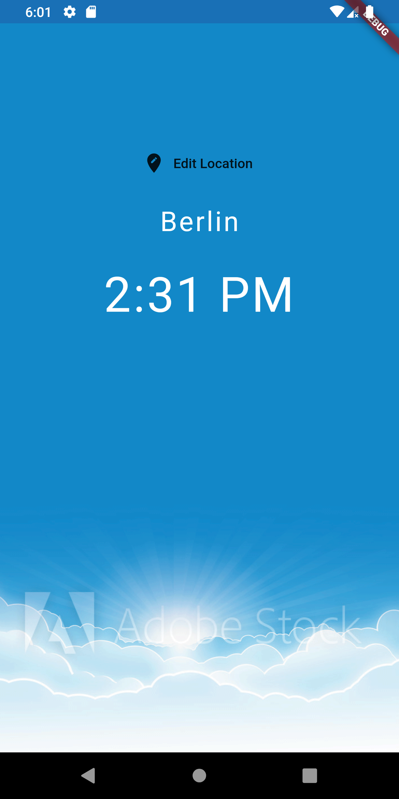
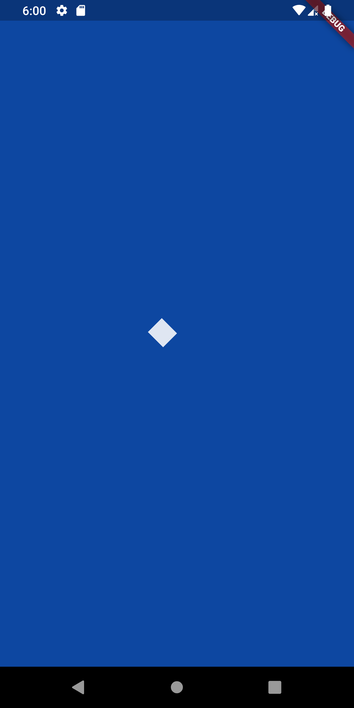
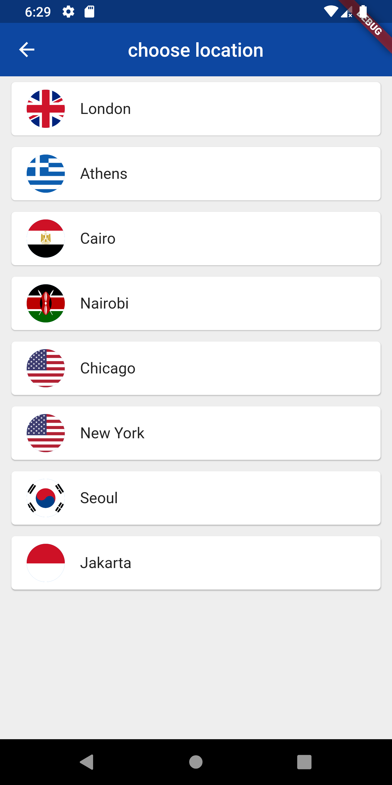
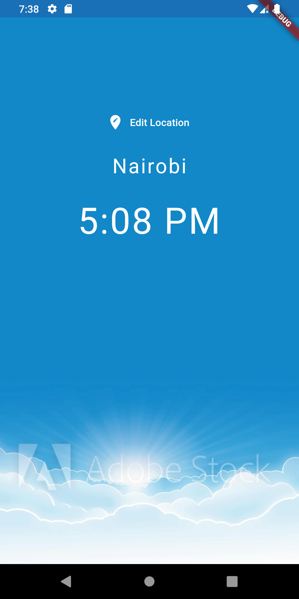

# flutter_app_first

First flutter application using https://www.youtube.com/watch?v=c063ddhWafo&list=PL4cUxeGkcC9jLYyp2Aoh6hcWuxFDX6PBJ&index=15 
url

## Getting Started

This project is a starting point for a Flutter application.

### Branch 2 screenshot

### Branch 3 screenshot

### Branch 4 screenshot

### Branch 5 screenshot

 

### Branch 6 screenshot

### Branch 7 screenshot

### Branch 8 screenshot

 

### Branch 14 screenshot

 

### Branch 15 screenshot

 

### Branch 16 screenshot

   

