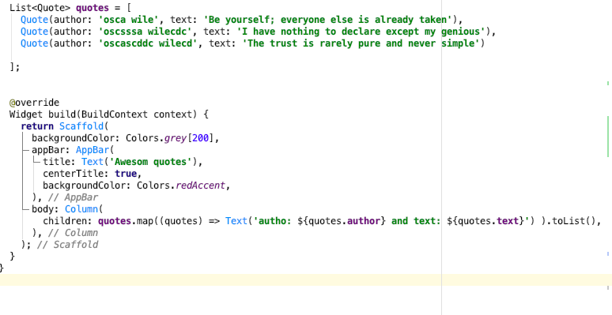

# flutter_app_first

First flutter application using https://www.youtube.com/watch?v=c063ddhWafo&list=PL4cUxeGkcC9jLYyp2Aoh6hcWuxFDX6PBJ&index=15 
url

### Branch 2 screenshot

### Branch 3 screenshot

### Branch 4 screenshot

 

### Branch 5 screenshot

  

### Branch 6 screenshot

### Branch 7 screenshot

### Branch 8 screenshot

  

### Branch 9 screenshot

### Branch 10 screenshot

### Branch 11 screenshot

### Branch 14 screenshot

### Branch 15 screenshot

### Branch 16 screenshot

## Getting Started

This project is a starting point for a Flutter application.
